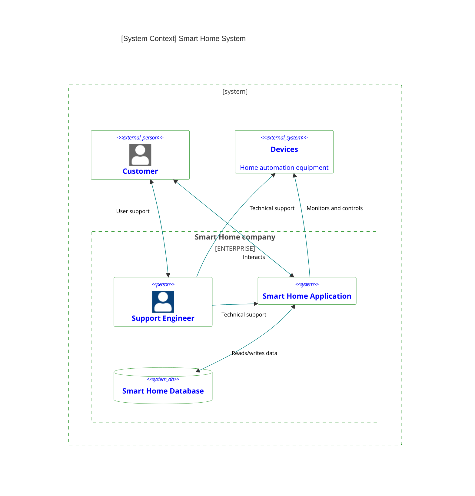

# Задание 1. Анализ и планирование

<aside>

Чтобы составить документ с описанием текущей архитектуры приложения, можно часть информации взять из описания компании и условия задания. Это нормально.

</aside>

### 1. Описание функциональности монолитного приложения

**Управление отоплением:**

- Пользователи могут удалённо включать/выключать отопление в своих домах.
- Пользователи могут устанавливать желаемую температуру помещения в своих домах.
- Система поддерживает полное отключение отопления в необходимой локации
- Система поддерживает регулировку температуры в необходимой локации за счет удаленных сигналов 
на управляющее устройство в системе отопления дома

**Мониторинг температуры:**

- Пользователи могут просматривать текущую температуру в своих домах.
- Специалист по подключению системы отопления может регистрировать датчики температуры в системе
- Система поддерживает получение данных о температуре с датчиков, установленных в домах
- Система поддерживает первичную регистрацию датчика температуры с привязкой к локации
- Система поддерживает отключение датчика температуры

**Первичная регистрация пользователя и локации**
- Специалист по подключению системы отопления может регистрировать учетные данные 
пользователя и его локации в системе
- Система поддерживает первичную регистрацию пользователя
- Система поддерживает первичную регистрацию локации
- Система поддерживает отключение пользователя

### 2. Анализ архитектуры монолитного приложения

- Язык программирования: Go
- База данных: PostgreSQL
- Архитектура: Монолитная, все компоненты системы (обработка запросов, бизнес-логика, работа с данными) находятся в рамках одного приложения.
- Взаимодействие: Синхронное, запросы обрабатываются последовательно.
- Масштабируемость: Ограничена, так как монолит сложно масштабировать по частям.
- Развертывание: Требует остановки всего приложения.

### 3. Определение доменов и границы контекстов

```text
[DOMAIN] Автоматизация климата для умного дома
│
├── [SUBDOMAIN] Клиентский Сервис (Supporting)
│   ├── [CONTEXT] Учетные записи
│   └── [CONTEXT] Помещения и локации
│
├── [SUBDOMAIN] Управление оборудованием (Supporting/Core)
│   ├── [CONTEXT] Температурные датчики
│   └── [CONTEXT] Исполнительные устройства, Контроллеры
│
└── [SUBDOMAIN] Климат-контроль (Core)
    └── [CONTEXT] Регулирование температуры помещения
```

### **4. Проблемы монолитного решения**

- Сильная связность функционала, что увеличивает риск ошибок
- Сложнее масштабировать приложение, нет возможности масштабирования отдельных частей
- Снижение темпов разработки по мере роста кодовой базы
- Трудоемкость обновлений — любое обновление требует тщательного тестирования всей системы

Все эти пункты критичны в нашем случае, с учетом планов по масштабированию и резкого роста клиентской базы.
### 5. Визуализация контекста системы — диаграмма С4



# Задание 2. Проектирование микросервисной архитектуры

В этом задании вам нужно предоставить только диаграммы в модели C4. Мы не просим вас отдельно описывать получившиеся микросервисы и то, как вы определили взаимодействия между компонентами To-Be системы. Если вы правильно подготовите диаграммы C4, они и так это покажут.

**Диаграмма контейнеров (Containers)**

Добавьте диаграмму.

**Диаграмма компонентов (Components)**

Добавьте диаграмму для каждого из выделенных микросервисов.

**Диаграмма кода (Code)**

Добавьте одну диаграмму или несколько.

# Задание 3. Разработка ER-диаграммы

Добавьте сюда ER-диаграмму. Она должна отражать ключевые сущности системы, их атрибуты и тип связей между ними.

# Задание 4. Создание и документирование API

### 1. Тип API

Укажите, какой тип API вы будете использовать для взаимодействия микросервисов. Объясните своё решение.

### 2. Документация API

Здесь приложите ссылки на документацию API для микросервисов, которые вы спроектировали в первой части проектной работы. Для документирования используйте Swagger/OpenAPI или AsyncAPI.

# Задание 5. Работа с docker и docker-compose

Перейдите в apps.

Там находится приложение-монолит для работы с датчиками температуры. В README.md описано как запустить решение.

Вам нужно:

1) сделать простое приложение temperature-api на любом удобном для вас языке программирования, которое при запросе /temperature?location= будет отдавать рандомное значение температуры.

Locations - название комнаты, sensorId - идентификатор названия комнаты

```
	// If no location is provided, use a default based on sensor ID
	if location == "" {
		switch sensorID {
		case "1":
			location = "Living Room"
		case "2":
			location = "Bedroom"
		case "3":
			location = "Kitchen"
		default:
			location = "Unknown"
		}
	}

	// If no sensor ID is provided, generate one based on location
	if sensorID == "" {
		switch location {
		case "Living Room":
			sensorID = "1"
		case "Bedroom":
			sensorID = "2"
		case "Kitchen":
			sensorID = "3"
		default:
			sensorID = "0"
		}
	}
```

2) Приложение следует упаковать в Docker и добавить в docker-compose. Порт по умолчанию должен быть 8081

3) Кроме того для smart_home приложения требуется база данных - добавьте в docker-compose файл настройки для запуска postgres с указанием скрипта инициализации ./smart_home/init.sql

Для проверки можно использовать Postman коллекцию smarthome-api.postman_collection.json и вызвать:

- Create Sensor
- Get All Sensors

Должно при каждом вызове отображаться разное значение температуры

Ревьюер будет проверять точно так же.


# **Задание 6. Разработка MVP**

Необходимо создать новые микросервисы и обеспечить их интеграции с существующим монолитом для плавного перехода к микросервисной архитектуре. 

### **Что нужно сделать**

1. Создайте новые микросервисы для управления телеметрией и устройствами (с простейшей логикой), которые будут интегрированы с существующим монолитным приложением. Каждый микросервис на своем ООП языке.
2. Обеспечьте взаимодействие между микросервисами и монолитом (при желании с помощью брокера сообщений), чтобы постепенно перенести функциональность из монолита в микросервисы. 

В результате у вас должны быть созданы Dockerfiles и docker-compose для запуска микросервисов. 